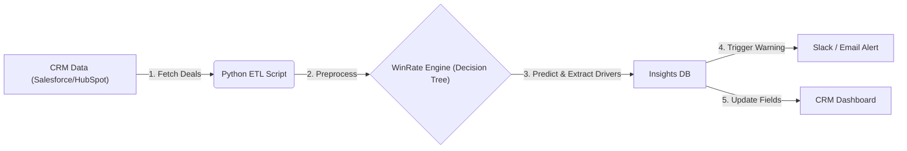

# SkyGeni Sales Insight Engine 

## Overview
This project is a lightweight **Sales Insight & Alert System** designed to predict the probability of winning a sales deal based on historical data. It processes raw CRM data, trains a Decision Tree classifier, and extracts the key drivers (features) that influence a "Won" or "Lost" outcome.

## 📂 Project Structure
* `src/decision_engine.py`: The core logic class (`WinRateDriverEngine`) that handles data cleaning, preprocessing, and model training.
* `notebooks/analysis.ipynb`: The Jupyter Notebook used for exploratory data analysis (EDA) and running the driver code.
* `data/skygeni_sales_data.csv`: The dataset used for training and testing.
* `images/`: Generated visualization exports (Win Rate, Segmentation, Loss Analysis).
* `requirements.txt`: List of Python dependencies.

## ⚙️ Setup & Installation
1.  **Clone the repository:**
    ```bash
    git clone https://github.com/MeghnaB12/skygeni-sales-engine.git
    cd skygeni-sales-engine
    ```
2.  **Create and activate a virtual environment (optional but recommended):**
    ```bash
    python -m venv .venv
    source .venv/bin/activate  # On Windows: .venv\Scripts\activate
    ```
3.  **Install dependencies:**
    ```bash
    pip install -r requirements.txt
    ```

## 🚀 How to Run
This project is designed to be run via Jupyter Notebook.

1.  **Launch Jupyter:**
    ```bash
    jupyter notebook
    ```
2.  **Open the notebook:**
    Navigate to the `notebooks/` folder and open `analysis.ipynb`.
3.  **Run all cells:**
    The notebook imports the engine from `src/`, loads data from `data/`, and generates insights.

## 🧠 Approach & Architecture
The solution follows a standard ML pipeline:
1.  **Data Cleaning:**
    * Standardized `outcome` to binary (1=Won, 0=Lost).
    * Imputed missing numeric values with medians and categorical values with "Unknown".
2.  **Feature Engineering:**
    * Calculated `sales_cycle_days` if missing.
    * Encoded categorical variables (`Industry`, `Region`) using One-Hot Encoding.
3.  **Modeling:**
    * Used a **Decision Tree Classifier** (`max_depth=3`) for maximum interpretability.
    

# Part 1: Problem Framing & Business Logic

1. What is the real business problem? 

    The CRO is facing a classic "Pipeline Quantity vs. Quality" paradox. High volume with dropping win rates usually means the pipeline is bloated with low-intent leads or there is a late-stage execution failure. The core issue isn't just that deals are       being lost; it's that the sales team can no longer distinguish between real revenue opportunities and noise, causing them to waste time on deals that were never going to close.


2. What key questions should the AI answer? 

* Is the rot systemic or isolated? Is the drop happening everywhere, or is it just the EMEA team or the Enterprise segment failing?
* Where is the leakage? Are we losing people at the "Demo" stage (bad leads) or "Negotiation" (bad closing/pricing)?
* Is the "Healthy Pipeline" actually healthy? What percentage of open deals are "zombies" that haven't moved in 30+ days but are still being forecasted?


3. What metrics matter most for diagnosis? 

  Standard Win Rate is a lagging indicator; by the time you see it drop, the revenue is already gone. I would focus on:

* Stage-by-Stage Conversion: To pinpoint exactly where the drop-off cliff is.
* Pipeline Velocity: (WinRate×DealSize)/SalesCycle. This tells us if deals are slowing down before they die.
* Stalled Deal Ratio: The % of open pipeline with zero stage progression in 30 days. This immediately identifies bloat.

4. What assumptions are you making? 

    I am assuming Data Integrity—that reps are actually updating closed_date and outcome accurately. If reps leave lost deals as "Open" to hide bad numbers, our velocity metrics will be skewed. I also assume a Stable Lead Definition; if Marketing recently     lowered the criteria for an "SQL" to hit their own volume targets, that would artificially inflate volume while tanking the win rate naturally.

# Part 2 – Data Exploration & Insights

1. The "Volume Trap" (Volume vs. Win Rate)

    * Observation: While our deal volume (blue bars) has remained strong or increased, the overall Win Rate (red line) has dropped significantly from ~50% to ~35% over the last 6 months.

    * Why does it matter? 
      This confirms the "Pipeline Bloat" hypothesis. The sales team is adding more deals to the top of the funnel to maintain the appearance of growth, but these deals are lower quality and are not converting. We are confusing activity with productivity.

    * Action to take: Implement stricter Pipeline Entry Criteria. A deal should not move past "Prospecting" unless a budget holder is identified. This will lower volume but increase win rates and forecast accuracy.

2. The "Negotiation" Bottleneck (Loss by Stage)

    * Observation: We are losing nearly as many deals at the "Negotiation" stage (~550 deals) as we are at the early "Demo" stage.

    * Why does it matter? 
      Losing at the "Demo" stage is healthy (fast failure). Losing at "Negotiation" is expensive. It means our reps spent 3-4 months working a deal, flew to meetings, and did demos, only to lose at the finish line. This indicates a failure in Closing            Capabilities or Pricing Strategy, not just lead quality.

    * Action to take: Launch a "Deal Desk" review for all deals entering Negotiation. A senior leader must sign off on the closing strategy before the final contract is sent to prevent late-stage fumbles.

3. Systemic Stagnation (Regional Heatmap)

    * Observation: The heatmap shows a "sea of orange." Win rates are consistently low (41%–47%) across almost all regions and industries. There is no single "bad apple" region dragging us down.

    * Why does it matter? 
      Since the issue is global, not local, it points to a Product-Market Fit or Macro-Pricing issue. If only EMEA were red, we would blame the EMEA team. Since everyone is red, the problem is likely the product or the price list itself.

    * Action to take: Conduct a Win/Loss Analysis survey. Interview the last 50 lost prospects globally to see if "Price" was the primary objection. If so, re-evaluate our packaging strategy.


## 📐 Custom Metrics Analysis

4. The "Sluggish Pipeline" (Efficiency Paradox)

    * Metric Definition: Percentage of open deals that have taken >1.3× the median sales cycle to close.

    * Result: 34.0% of our active pipeline is "Sluggish."

    * Why does it matter? 
      Normally, slow deals are "bad" deals. However, our data shows a paradox: Sluggish deals have a 44% Win Rate (nearly identical to the 46% average). These aren't "dead" deals; they are just resource-heavy. They eventually close, but they clog up rep         capacity and make monthly forecasting impossible because they drift across quarters.

    * Action to take: Do not auto-close, as that would destroy viable revenue. Instead, implement a "Stall-Breaker" Campaign. Trigger at 60 days of stagnation and send an automated "Executive Sponsor" email to the prospect to force a decision (up or out).       We need to force these deals to close faster, not kill them.

5. Pipeline Velocity (Revenue Efficiency)

    * Metric Definition: (WinRate×DealSize)/SalesCycleDays.

    * Result: The India region has the highest velocity (~$189/day), outperforming North America ($182/day).

    * Why does it matter? 
      Contrary to expectation, India isn't closing faster; they are closing better. India has the highest Win Rate (45.7%) and highest Deal Size of any region. North America is churning through deals slightly faster, but losing more of them and at lower         values.

    * Action to take: Replicate the India Playbook. Analyze the sales scripts and objection-handling techniques used by the India team, as they are managing to close larger deals with a higher success rate than their US counterparts.


# Part 3 – Build a Decision Engine

## Win Rate Driver Analysis

1. *Problem Definition* : The CRO knows that win rates are dropping, but not why. A standard dashboard only shows correlation (e.g., "Win rate is low in EMEA"). It does not show causation or relative importance. We need a system that mathematically ranks which factors (Region, Deal Size, Lead Source) are the strongest predictors of a deal's outcome.

2. *The Solution (Model Choice)* : I built a Decision Tree Classifier (Max Depth = 3).
Why this model? Unlike a Neural Network, a Decision Tree is transparent. It generates human-readable rules (e.g., "IF Deal > $50k AND Region = EMEA, THEN Risk = High").
Features Used: Deal Amount, Sales Cycle Days, Region, Industry, Lead Source, Product Type.

3. *How a Sales Leader Would Use This*

    * Strategic Planning: Since Deal Amount is the #1 driver, the leader should restructure territories. "Whale Deals" (High Amount) should only be assigned to Senior Reps, while Juniors focus on smaller, high-velocity deals.

    * Intervention Alerts: The model shows Time is the #2 killer. Managers can set up an automated Slack alert: "Warning: Deal X has exceeded 60 days. Win probability has dropped by 40%. Intervene now."

    * Focus Shift: The leader can stop blaming the "North America Team" (0% impact) and instead focus on fixing the global pricing strategy, as the issue is deal-based, not location-based.

# Part 4 – Mini System Design

A lightweight, automated engine that monitors deal health and delivers actionable win/loss insights to sales reps.

1. High-Level Architecture

    A simple Extract-Analyze-Act loop.
   
        * Connector: Fetches deal data from CRM (Salesforce/HubSpot) via API.
        * Brain (The Engine): Runs our WinRateDriverEngine to calculate Win Probability & Key Drivers.
        * Notifier: Pushes alerts to Slack/Email or updates fields back in the CRM.


2. Data Flow

* Trigger: Scheduled Cron Job (e.g., 6:00 AM Daily).
* Ingest: Python script pulls open deals modified in the last 24 hours.
* Process:
    Clean data & feature engineer (e.g., calculate sales_cycle_days).
    Model Inference: Predict Win_Probability for each deal.
    Driver Analysis: Identify why the score is high/low (e.g., "Region = APAC").
* Output: If Win_Probability drops below threshold → Trigger Alert.

3. Example Alerts & Insights

    The "At-Risk" Alert:
    Trigger: Win Probability drops by >15% since last week.
    Message: "⚠️ Deal Risk: dropped to 40% win chance. Reason: Sales cycle exceeds industry avg by 20 days."

    The "Coaching" Insight:
    Trigger: New deal created in a high-loss segment.
    Message: "ℹ️ Insight: History shows 'Enterprise' deals in 'Europe' have a 20% lower win rate. Suggestion: Involve a Sales Engineer early."

    The "Stall" Warning:
    Trigger: No stage movement for 14 days.
    Message: "📉 Stalled: [Globex Deal] has been stagnant. Action: Schedule follow-up or mark Closed-Lost."

4. Execution Frequency

    Daily Batch (Recommended): Runs every morning before reps start work.
    Reason : Less resource-intensive than real-time; gives reps a "daily briefing."

5. Failure Cases & Limitations

    * Data Quality: If CRM fields (like Industry or Region) are left blank, predictions will be inaccurate.
    * Model Drift: If market conditions change (e.g., new competitor), the model needs retraining every month.
    * Cold Start: New sales reps or new products won't have enough historical data for accurate predictions initially.

# Part 5 – Reflection

1. What assumptions in your solution are weakest?

    * Data Integrity: I assumed the CRM data is accurate. 
    * Independence: The model treats every deal as an isolated event. It ignores external factors like macro-economic shifts, seasonality (e.g., End of Quarter), or marketing campaigns that might spike win rates temporarily.

2. What Would Break in Production?

    * Category Explosion: If the company enters a new market or adds 50 new Industries, the One-Hot Encoding will create too many features, leading to sparse data and overfitting.
    * Data Drift: The model is static. If pricing strategies change next month, the historical patterns used to train the tree become obsolete, and predictions will degrade rapidly without retraining.

3. What I Would Build Next (1-Month Roadmap)

    * Better Features: I would integrate Activity Data (e.g., number of emails exchanged, meetings booked). Behavioral data is often more predictive of a win than static fields like "Industry."
    * Explainability Layer: Implement SHAP values. Instead of just saying "Win Probability: 40%," it would say "This is low specifically because the Deal Amount is too high for this Region." This builds trust with sales reps.

4. Area of Least Confidence

    * Imputation Strategy: My current method of filling missing numerical values with the median and categorical values with "Unknown" is a blunt instrument. If data is missing not at random (e.g., reps only skip entering Deal Amount on low-priority             deals), this introduces significant bias.


